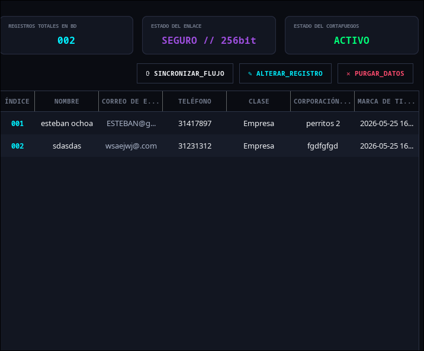
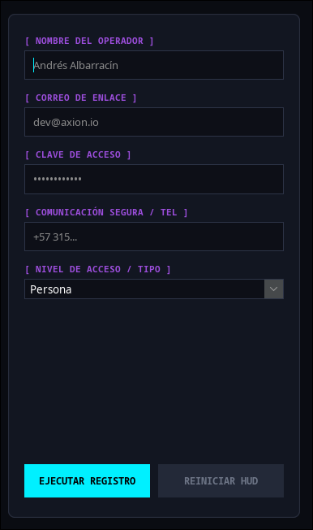
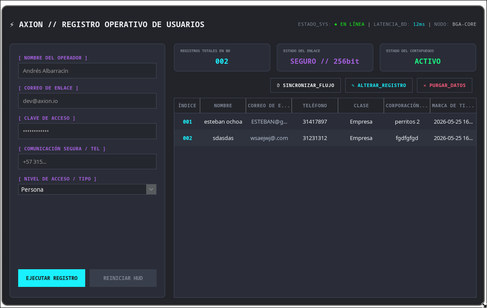

# ⚡ AXION // OPERATIONAL USER RECORD CONSOLE


> **AXION** es una solución avanzada de escritorio para la administración, persistencia y control de accesos de personal (CRUD). Desarrollado bajo la arquitectura **MVC / DAO** sobre **Java Swing**, el sistema implementa una interfaz táctica HUD (Heads-Up Display) inspirada en consolas de operaciones que redefine la interacción de usuario en software de escritorio tradicional.

---

## 📸 Demostración Visual del Entorno

Para mostrar el funcionamiento del sistema, guarda tus capturas en una carpeta llamada `screenshots` dentro de tu repositorio y el sistema las renderizará aquí automáticamente:

### 🖥️ Consola de Operaciones Completa
*Aquí se visualiza la integración total entre el panel de control y el feed de datos general:*



### 🛰️ Distribución de Módulos de la UI
| Módulo de Inyección (Formulario Reactivo) | Monitor del Datafeed (Tabla con Efecto Zebra) |
| :---: | :---: |
|  |  |

---

## 🌌 ¿Para qué sirve y cuál es su funcionalidad?

El software actúa como una **Consola de Seguridad y Control de Datos** centralizada. Su objetivo principal es permitir a los administradores gestionar el ciclo de vida completo de las cuentas operativas de una infraestructura.

### ⚙️ Funcionalidades Core del Sistema:
* **Inyección de Operadores (Create):** Captura de datos críticos como Identificación, Correo de enlace, Claves de seguridad enmascaradas y Niveles de acceso técnico.
* **Flujo Reactivo en Caliente:** El formulario detecta el tipo de cuenta seleccionado ("Empresa", "Asociación") y despliega dinámicamente el campo para la *Matriz de Organización* en caliente sin romper el Layout. Si se selecciona "Persona", dicho campo se oculta inmediatamente.
* **Sincronización del Datafeed (Read):** Mapeo automatizado de los registros alojados en la base de datos hacia un componente tabular moderno que prescinde de cuadrículas rígidas.
* **Alteración de Nodos (Update):** Recuperación de datos directo desde la tabla hacia los campos del formulario con un solo clic, permitiendo sobreescribir configuraciones.
* **Purga de Bloques (Delete):** Sistema de borrado definitivo conectado a un cuadro de diálogo de confirmación doble para evitar pérdidas accidentales de información.

---

## 🧠 ¿Cómo funciona por dentro? (Arquitectura Técnica)

El software fue construido bajo un patrón de diseño desacoplado que separa la interfaz gráfica de las reglas de negocio y las consultas SQL. El proyecto se compila y gestiona utilizando **Apache Ant**.

```text
src/
└── registroapp/
    ├── Conexion.java          # Puente de red JDBC y credenciales de MySQL.
    ├── Usuario.java           # Modelo de datos / Entidad del Operador (POJO).
    ├── UsuarioDAO.java        # Capa de persistencia (Sentencias SQL puras).
    └── FormularioRegistro.java # Capa de visualización (Look & Feel + GridBagLayout).
```

### 🛠️ Detalles Avanzados de Ingeniería UI:
1. **Teoría del Color y Profundidad:** Utiliza capas de oscuridad. El fondo base (`#0A0C12`) es un azul medianoche ultra profundo, mientras que los paneles (`#121621`) usan relieves con sutiles filamentos neón (`#00F0FF`).
2. **Zebra Striping Computado:** La tabla calcula dinámicamente el color de fondo usando el módulo de la fila (`row % 2 == 0`), mejorando la lectura de datos sin grillas rígidas de Excel.
3. **Formateo Militar de Índices:** El ID de los registros se transforma en un código numérico fijo de tres dígitos (`001`, `002`), emulando terminales de datos reales.
4. **Control de Layout por Empuje Vertical:** El panel izquierdo utiliza `GridBagLayout` configurando un peso gravitacional vertical (`weighty = 1.0`). Esto actúa como un resorte que empuja los botones hacia la base (`SOUTH`), asegurando simetría visual.

---

## 💻 CÓDIGO FUENTE COMPLETO DE LA UI (`FormularioRegistro.java`)

A continuación se expone el código fuente integrado y verificado para la auditoría de la interfaz visual del sistema:

```java
package registroapp;

import javax.swing.*;
import javax.swing.table.DefaultTableCellRenderer;
import javax.swing.table.DefaultTableModel;
import javax.swing.table.JTableHeader;
import java.awt.*;
import java.util.List;

public class FormularioRegistro extends JFrame {
    // ── Campos del formulario ────────────────────────────────────────────────
    private JTextField txtNombre, txtCorreo, txtTelefono, txtNombreEntidad;
    private JPasswordField txtContrasena;
    private JComboBox<String> cmbTipo;
    private JLabel lblNombreEntidad;

    // ── Tabla ────────────────────────────────────────────────────────────────
    private JTable tabla;
    private DefaultTableModel modeloTabla;
    private JLabel lblContadorRegistros; 

    // ── Botones ──────────────────────────────────────────────────────────────
    private JButton btnRegistrar, btnEditar, btnEliminar, btnRefrescar, btnLimpiar;

    // ── DAO ──────────────────────────────────────────────────────────────────
    private final UsuarioDAO dao = new UsuarioDAO();
    private int idSeleccionado = -1;

    // ── PALETA DE COLORES NEÓN PREMIUM (Cyberpunk / Matrix Sleek) ────────────
    private final Color CORE_BG      = new Color(10, 12, 18);    
    private final Color PANEL_BG     = new Color(18, 22, 33);    
    private final Color INPUT_BG     = new Color(13, 15, 23);    
    private final Color NEON_CYAN    = new Color(0, 240, 255);   
    private final Color NEON_PURPLE  = new Color(157, 78, 221);  
    private final Color TEXT_MAIN    = new Color(240, 242, 245);  
    private final Color TEXT_MUTED   = new Color(110, 118, 135); 

    // ════════════════════════════════════════════════════════════════════════
    public FormularioRegistro() {
        setTitle("CONSOLA CENTRAL DE SISTEMA // v3.0.0");
        setSize(1120, 720);
        setDefaultCloseOperation(JFrame.EXIT_ON_CLOSE);
        setLocationRelativeTo(null);
        setResizable(false);

        initUI();
        cargarTabla();
    }

    // ── Componente Personalizado: Panel con bordes redondeados y Neón ────────
    class NeonPanel extends JPanel {
        private Color borderColor;
        public NeonPanel(Color borderColor) {
            this.borderColor = borderColor;
            setOpaque(false);
        }
        @Override
        protected void paintComponent(Graphics g) {
            Graphics2D g2 = (Graphics2D) g.create();
            g2.setRenderingHint(RenderingHints.KEY_ANTIALIASING, RenderingHints.VALUE_ANTIALIAS_ON);
            g2.setColor(PANEL_BG);
            g2.fillRoundRect(0, 0, getWidth(), getHeight(), 16, 16);
            g2.setColor(borderColor);
            g2.setStroke(new BasicStroke(1.2f));
            g2.drawRoundRect(0, 0, getWidth() - 1, getHeight() - 1, 16, 16);
            g2.dispose();
            super.paintComponent(g);
        }
    }

    // ── Construcción de la UI Avanzada ───────────────────────────────────────
    private void initUI() {
        getContentPane().setBackground(CORE_BG);
        setLayout(new BorderLayout(20, 20));
        ((JPanel)getContentPane()).setBorder(BorderFactory.createEmptyBorder(15, 15, 15, 15));

        // ════════════════════════════════════════════════════════════════════
        // 1. HEADER CON TELEMETRÍA 
        // ════════════════════════════════════════════════════════════════════
        JPanel headerPanel = new JPanel(new BorderLayout());
        headerPanel.setOpaque(false);
        headerPanel.setPreferredSize(new Dimension(0, 50));

        JLabel lblTitulo = new JLabel("⚡ AXION // REGISTRO OPERATIVO DE USUARIOS");
        lblTitulo.setFont(new Font("Monospaced", Font.BOLD, 18));
        lblTitulo.setForeground(TEXT_MAIN);

        JLabel lblTelemetry = new JLabel("<html><font color='#6e7687'>ESTADO_SYS:</font> <font color='#00ff00'>● EN LÍNEA</font> | <font color='#6e7687'>LATENCIA_BD:</font> <font color='#00f0ff'>12ms</font> | <font color='#6e7687'>NODO:</font> BGA-CORE</html>");
        lblTelemetry.setFont(new Font("Monospaced", Font.PLAIN, 11));

        headerPanel.add(lblTitulo, BorderLayout.WEST);
        headerPanel.add(lblTelemetry, BorderLayout.EAST);
        add(headerPanel, BorderLayout.NORTH);

        // ════════════════════════════════════════════════════════════════════
        // 2. PANEL IZQUIERDO: FORMULARIO HUD
        // ════════════════════════════════════════════════════════════════════
        NeonPanel panelForm = new NeonPanel(new Color(40, 45, 60));
        panelForm.setLayout(new GridBagLayout());
        panelForm.setPreferredSize(new Dimension(360, 0));
        panelForm.setBorder(BorderFactory.createEmptyBorder(25, 20, 25, 20));

        GridBagConstraints gbc = new GridBagConstraints();
        gbc.fill = GridBagConstraints.HORIZONTAL;
        gbc.weightx = 1.0;
        gbc.gridx = 0;

        java.util.function.Function<String, JLabel> mkLabel = (txt) -> {
            JLabel l = new JLabel("[ " + txt + " ]");
            l.setFont(new Font("Monospaced", Font.BOLD, 11));
            l.setForeground(NEON_PURPLE);
            return l;
        };

        java.util.function.Supplier<JTextField> mkInput = () -> {
            JTextField t = new JTextField();
            t.setBackground(INPUT_BG);
            t.setForeground(Color.WHITE);
            t.setFont(new Font("SansSerif", Font.PLAIN, 13));
            t.setCaretColor(NEON_CYAN);
            t.setBorder(BorderFactory.createCompoundBorder(
                BorderFactory.createLineBorder(new Color(45, 52, 71), 1),
                BorderFactory.createEmptyBorder(8, 10, 8, 10)));
            return t;
        };

        JLabel l1 = mkLabel.apply("NOMBRE DEL OPERADOR"); gbc.gridy = 0; gbc.insets = new Insets(0,0,4,0); panelForm.add(l1, gbc);
        txtNombre = mkInput.get(); txtNombre.putClientProperty("JTextField.placeholderText", "Andrés Albarracín");
        gbc.gridy = 1; gbc.insets = new Insets(0,0,14,0); panelForm.add(txtNombre, gbc);

        JLabel l2 = mkLabel.apply("CORREO DE ENLACE"); gbc.gridy = 2; gbc.insets = new Insets(0,0,4,0); panelForm.add(l2, gbc);
        txtCorreo = mkInput.get(); txtCorreo.putClientProperty("JTextField.placeholderText", "dev@axion.io");
        gbc.gridy = 3; gbc.insets = new Insets(0,0,14,0); panelForm.add(txtCorreo, gbc);

        JLabel l3 = mkLabel.apply("CLAVE DE ACCESO"); gbc.gridy = 4; gbc.insets = new Insets(0,0,4,0); panelForm.add(l3, gbc);
        txtContrasena = new JPasswordField();
        txtContrasena.setBackground(INPUT_BG); txtContrasena.setForeground(Color.WHITE);
        txtContrasena.setCaretColor(NEON_CYAN);
        txtContrasena.setBorder(BorderFactory.createCompoundBorder(BorderFactory.createLineBorder(new Color(45, 52, 71), 1), BorderFactory.createEmptyBorder(8, 10, 8, 10)));
        txtContrasena.putClientProperty("JTextField.placeholderText", "••••••••••••");
        gbc.gridy = 5; gbc.insets = new Insets(0,0,14,0); panelForm.add(txtContrasena, gbc);

        JLabel l4 = mkLabel.apply("COMUNICACIÓN SEGURA / TEL"); gbc.gridy = 6; gbc.insets = new Insets(0,0,4,0); panelForm.add(l4, gbc);
        txtTelefono = mkInput.get(); txtTelefono.putClientProperty("JTextField.placeholderText", "+57 315...");
        gbc.gridy = 7; gbc.insets = new Insets(0,0,14,0); panelForm.add(txtTelefono, gbc);

        JLabel l5 = mkLabel.apply("NIVEL DE ACCESO / TIPO"); gbc.gridy = 8; gbc.insets = new Insets(0,0,4,0); panelForm.add(l5, gbc);
        cmbTipo = new JComboBox<>(new String[]{"Persona", "Empresa", "Asociación"});
        cmbTipo.setBackground(INPUT_BG); cmbTipo.setForeground(Color.WHITE);
        cmbTipo.setBorder(BorderFactory.createLineBorder(new Color(45, 52, 71), 1));
        gbc.gridy = 9; gbc.insets = new Insets(0,0,14,0); panelForm.add(cmbTipo, gbc);

        lblNombreEntidad = mkLabel.apply("MATRIZ DE ORGANIZACIÓN"); lblNombreEntidad.setVisible(false);
        gbc.gridy = 10; gbc.insets = new Insets(0,0,4,0); panelForm.add(lblNombreEntidad, gbc);
        txtNombreEntidad = mkInput.get(); txtNombreEntidad.setVisible(false);
        gbc.gridy = 11; gbc.insets = new Insets(0,0,14,0); panelForm.add(txtNombreEntidad, gbc);

        cmbTipo.addActionListener(e -> {
            boolean ex = !cmbTipo.getSelectedItem().equals("Persona");
            lblNombreEntidad.setVisible(ex); txtNombreEntidad.setVisible(ex);
            panelForm.revalidate(); panelForm.repaint();
        });

        JPanel panelAccionesForm = new JPanel(new GridLayout(1, 2, 10, 0));
        panelAccionesForm.setOpaque(false);
        btnRegistrar = crearBotonSolido("EJECUTAR REGISTRO", NEON_CYAN, Color.BLACK);
        btnLimpiar   = crearBotonSolido("REINICIAR HUD", new Color(35, 41, 56), TEXT_MUTED);
        panelAccionesForm.add(btnRegistrar); panelAccionesForm.add(btnLimpiar);

        gbc.gridy = 12; 
        gbc.weighty = 1.0; 
        gbc.anchor = GridBagConstraints.SOUTH;
        gbc.fill = GridBagConstraints.HORIZONTAL;
        gbc.insets = new Insets(20, 0, 0, 0);
        panelForm.add(panelAccionesForm, gbc);

        add(panelForm, BorderLayout.WEST);

        // ════════════════════════════════════════════════════════════════════
        // 3. PANEL DERECHO: TARJETAS (KPIS) + TABLA
        // ════════════════════════════════════════════════════════════════════
        JPanel panelDerechoContenedor = new JPanel(new BorderLayout(0, 15));
        panelDerechoContenedor.setOpaque(false);

        JPanel panelStats = new JPanel(new GridLayout(1, 3, 15, 0));
        panelStats.setOpaque(false);
        panelStats.setPreferredSize(new Dimension(0, 65));

        lblContadorRegistros = new JLabel("000", JLabel.CENTER);
        panelStats.add(crearCardAnalitica("REGISTROS TOTALES EN BD", lblContadorRegistros, NEON_CYAN));
        panelStats.add(crearCardAnalitica("ESTADO DEL ENLACE", new JLabel("SEGURO // 256bit", JLabel.CENTER), NEON_PURPLE));
        panelStats.add(crearCardAnalitica("ESTADO DEL CORTAFUEGOS", new JLabel("ACTIVO", JLabel.CENTER), new Color(0, 255, 120)));
        panelDerechoContenedor.add(panelStats, BorderLayout.NORTH);

        JPanel panelTablaEstructura = new JPanel(new BorderLayout(0, 12));
        panelTablaEstructura.setOpaque(false);

        JPanel barraControlTabla = new JPanel(new FlowLayout(FlowLayout.RIGHT, 10, 0));
        barraControlTabla.setOpaque(false);
        btnRefrescar = crearBotonTerminal("⟳ SINCRONIZAR_FLUJO", TEXT_MAIN);
        btnEditar    = crearBotonTerminal("✎ ALTERAR_REGISTRO", NEON_CYAN);
        btnEliminar  = crearBotonTerminal("✕ PURGAR_DATOS", new Color(255, 75, 110));
        barraControlTabla.add(btnRefrescar); barraControlTabla.add(btnEditar); barraControlTabla.add(btnEliminar);
        panelTablaEstructura.add(barraControlTabla, BorderLayout.NORTH);

        String[] cols = {"ÍNDICE", "NOMBRE", "CORREO DE ENLACE", "TELÉFONO", "CLASE", "CORPORACIÓN / ENTIDAD", "MARCA DE TIEMPO"};
        modeloTabla = new DefaultTableModel(cols, 0) {
            @Override public boolean isCellEditable(int r, int c) { return false; }
        };

        tabla = new JTable(modeloTabla);
        tabla.setBackground(PANEL_BG);
        tabla.setForeground(TEXT_MAIN);
        tabla.setRowHeight(38);
        tabla.setFont(new Font("SansSerif", Font.PLAIN, 13));
        tabla.setShowGrid(false);
        tabla.setIntercellSpacing(new Dimension(0, 0));
        tabla.setSelectionBackground(new Color(0, 240, 255, 25));
        tabla.setSelectionForeground(Color.WHITE);

        JTableHeader h = tabla.getTableHeader();
        h.setBackground(CORE_BG);
        h.setForeground(TEXT_MUTED);
        h.setFont(new Font("Monospaced", Font.BOLD, 11));
        h.setPreferredSize(new Dimension(0, 35));
        h.setBorder(BorderFactory.createMatteBorder(0, 0, 1, 0, new Color(45, 52, 71)));

        tabla.getColumnModel().getColumn(0).setMaxWidth(60);

        tabla.setDefaultRenderer(Object.class, new DefaultTableCellRenderer() {
            @Override
            public Component getTableCellRendererComponent(JTable table, Object value, boolean isSel, boolean hasFoc, int row, int col) {
                Component c = super.getTableCellRendererComponent(table, value, isSel, hasFoc, row, col);
                if (!isSel) c.setBackground(row % 2 == 0 ? PANEL_BG : new Color(23, 28, 41));
                if (col == 0 && value instanceof Integer) {
                    setHorizontalAlignment(JLabel.CENTER);
                    setForeground(NEON_CYAN);
                    setFont(new Font("Monospaced", Font.BOLD, 12));
                    setText(String.format("%03d", (Integer) value));
                } else if (!isSel) {
                    setForeground(TEXT_MAIN);
                    setFont(new Font("SansSerif", Font.PLAIN, 13));
                    if(col == 2) setForeground(new Color(170, 180, 200));
                }
                setBorder(BorderFactory.createEmptyBorder(0, 8, 0, 8));
                return c;
            }
        });

        JScrollPane scroll = new JScrollPane(tabla);
        scroll.setBorder(BorderFactory.createLineBorder(new Color(45, 52, 71), 1));
        scroll.getViewport().setBackground(PANEL_BG);
        panelTablaEstructura.add(scroll, BorderLayout.CENTER);

        panelDerechoContenedor.add(panelTablaEstructura, BorderLayout.CENTER);
        add(panelDerechoContenedor, BorderLayout.CENTER);

        btnRegistrar.addActionListener(e -> registrar());
        btnLimpiar.addActionListener(e   -> limpiar());
        btnRefrescar.addActionListener(e -> cargarTabla());
        btnEditar.addActionListener(e    -> cargarEnFormulario());
        btnEliminar.addActionListener(e  -> eliminar());
    }

    private JButton crearBotonSolido(String txt, Color bg, Color fg) {
        JButton b = new JButton(txt);
        b.setBackground(bg); b.setForeground(fg);
        b.setFont(new Font("Monospaced", Font.BOLD, 12));
        b.setCursor(Cursor.getPredefinedCursor(Cursor.HAND_CURSOR));
        b.setBorder(BorderFactory.createEmptyBorder(12, 15, 12, 15));
        b.putClientProperty("JButton.buttonType", "roundRect");
        return b;
    }

    private JButton crearBotonTerminal(String txt, Color neonColor) {
        JButton b = new JButton(txt);
        b.setForeground(neonColor);
        b.setFont(new Font("Monospaced", Font.BOLD, 11));
        b.setContentAreaFilled(false);
        b.setFocusPainted(false);
        b.setCursor(Cursor.getPredefinedCursor(Cursor.HAND_CURSOR));
        b.setBorder(BorderFactory.createCompoundBorder(
            BorderFactory.createLineBorder(new Color(45, 52, 71), 1),
            BorderFactory.createEmptyBorder(8, 14, 8, 14)
        ));
        return b;
    }

    private NeonPanel crearCardAnalitica(String desc, JLabel valueLabel, Color accentColor) {
        NeonPanel card = new NeonPanel(new Color(38, 43, 61));
        card.setLayout(new BorderLayout(0, 2));
        card.setBorder(BorderFactory.createEmptyBorder(10, 15, 10, 15));
        JLabel lblDesc = new JLabel(desc);
        lblDesc.setFont(new Font("Monospaced", Font.BOLD, 9));
        lblDesc.setForeground(TEXT_MUTED);
        valueLabel.setFont(new Font("Monospaced", Font.BOLD, 16));
        valueLabel.setForeground(accentColor);
        card.add(lblDesc, BorderLayout.NORTH);
        card.add(valueLabel, BorderLayout.CENTER);
        return card;
    }

    // ── LÓGICA DE CONTROL LOGÍSTICA (CRUD) ───────────────────────────────────
    private void registrar() {
        if (!validar()) return;
        Usuario u = new Usuario();
        u.setNombre(txtNombre.getText().trim());
        u.setCorreo(txtCorreo.getText().trim());
        u.setContrasena(new String(txtContrasena.getPassword()).trim());
        u.setTelefono(txtTelefono.getText().trim());
        u.setTipoCuenta((String) cmbTipo.getSelectedItem());
        u.setNombreEntidad(txtNombreEntidad.isVisible() ? txtNombreEntidad.getText().trim() : "");

        boolean ok;
        if (idSeleccionado == -1) {
            ok = dao.insertar(u);
            if (ok) mostrarMensaje("SISTEMA EX: Registro almacenado en la base de datos central.", false);
        } else {
            u.setId(idSeleccionado);
            ok = dao.actualizar(u);
            if (ok) mostrarMensaje("SISTEMA EX: Entrada modificada con éxito.", false);
        }

        if (!ok) mostrarMensaje("ERR CRÍTICO: Falla en la inyección de datos.", true);
        limpiar();
        cargarTabla();
    }

    private void cargarEnFormulario() {
        int f = tabla.getSelectedRow();
        if (f == -1) { mostrarMensaje("ALERTA: Selecciona una entrada de datos activa.", true); return; }

        idSeleccionado = (int) modeloTabla.getValueAt(f, 0);
        txtNombre.setText((String) modeloTabla.getValueAt(f, 1));
        txtCorreo.setText((String) modeloTabla.getValueAt(f, 2));
        txtContrasena.setText("");
        txtTelefono.setText((String) modeloTabla.getValueAt(f, 3));
        cmbTipo.setSelectedItem(modeloTabla.getValueAt(f, 4));
        String ent = (String) modeloTabla.getValueAt(f, 5);
        txtNombreEntidad.setText(ent != null ? ent : "");
        btnRegistrar.setText("ALTERAR REGISTRO");
    }

    private void eliminar() {
        int f = tabla.getSelectedRow();
        if (f == -1) { mostrarMensaje("ALERTA: Selecciona el nodo para purgar.", true); return; }

        int id = (int) modeloTabla.getValueAt(f, 0);
        String nom = (String) modeloTabla.getValueAt(f, 1);

        int conf = JOptionPane.showConfirmDialog(this,
            "ADVERTENCIA CRÍTICA:\n¿Deseas purgar de forma permanente la entrada \"" + nom + "\"?\nEsta operación romperá el bloque.", "CONSOLA DE SEGURIDAD",
            JOptionPane.YES_NO_OPTION, JOptionPane.WARNING_MESSAGE);

        if (conf == JOptionPane.YES_OPTION) {
            if (dao.eliminar(id)) {
                mostrarMensaje("SISTEMA EX: El registro ha sido purgado correctamente.", false);
                cargarTabla();
                limpiar();
            } else {
                mostrarMensaje("ERR CRÍTICO: Acceso denegado a la eliminación.", true);
            }
        }
    }

    private void cargarTabla() {
        modeloTabla.setRowCount(0);
        List<Usuario> lista = dao.obtenerTodos();
        for (Usuario u : lista) {
            modeloTabla.addRow(new Object[]{
                u.getId(), u.getNombre(), u.getCorreo(),
                u.getTelefono(), u.getTipoCuenta(),
                u.getNombreEntidad(), u.getFechaRegistro()
            });
        }
        lblContadorRegistros.setText(String.format("%03d", lista.size()));
    }

    private void limpiar() {
        idSeleccionado = -1;
        txtNombre.setText(""); txtCorreo.setText(""); txtContrasena.setText(""); txtTelefono.setText("");
        cmbTipo.setSelectedIndex(0); txtNombreEntidad.setText("");
        lblNombreEntidad.setVisible(false); txtNombreEntidad.setVisible(false);
        btnRegistrar.setText("EJECUTAR REGISTRO");
        tabla.clearSelection();
    }

    private boolean validar() {
        if (txtNombre.getText().trim().isEmpty()) { mostrarMensaje("ALERTA HUD: 'NOMBRE DEL OPERADOR' es requerido.", true); return false; }
        if (txtCorreo.getText().trim().isEmpty() || !txtCorreo.getText().contains("@")) { mostrarMensaje("ALERTA HUD: Formato de 'CORREO DE ENLACE' inválido.", true); return false; }
        if (idSeleccionado == -1 && new String(txtContrasena.getPassword()).trim().isEmpty()) { mostrarMensaje("ALERTA HUD: 'CLAVE DE ACCESO' vacía.", true); return false; }
        return true;
    }

    private void mostrarMensaje(String msg, boolean esError) {
        JOptionPane.showMessageDialog(this, msg, esError ? "REGISTRO DE ERRORES DEL SISTEMA" : "TRANSMISIÓN DEL SISTEMA",
            esError ? JOptionPane.ERROR_MESSAGE : JOptionPane.INFORMATION_MESSAGE);
    }

    public static void main(String[] args) {
        try {
            UIManager.put("Component.arc", 8);
            UIManager.put("Button.arc", 8);
            UIManager.put("TextComponent.arc", 6);
            com.formdev.flatlaf.FlatDarkLaf.setup();
        } catch (Exception e) {
            System.out.println("Falta archivo .jar de interfaz gráfica.");
        }
        SwingUtilities.invokeLater(() -> new FormularioRegistro().setVisible(true));
    }
}
```

---

## 🚀 Requisitos de Instalación e Inyección SQL

### 1. Librerías de Terceros Requeridas (.jar)
El proyecto requiere que agregues al directorio de librerías del proyecto (`lib/`) los siguientes conectores de manera obligatoria:
* `flatlaf-3.5.1.jar` - El motor CSS de estilos oscuros y curvas HUD.
* `mysql-connector-j-9.7.0.jar` - El driver JDBC de red para enlazar con las tablas SQL.

### 2. Base de Datos Estructurada
Ejecuta la siguiente estructura en tu gestor MySQL local antes de encender la aplicación:

```sql
CREATE DATABASE IF NOT EXISTS registroapp_db;
USE registroapp_db;

CREATE TABLE IF NOT EXISTS usuarios (
    id INT AUTO_INCREMENT PRIMARY KEY,
    nombre VARCHAR(100) NOT NULL,
    correo VARCHAR(100) NOT NULL UNIQUE,
    contrasena VARCHAR(255) NOT NULL,
    telefono VARCHAR(20),
    tipo_cuenta VARCHAR(30) NOT NULL,
    nombre_entidad VARCHAR(100) DEFAULT NULL,
    fecha_registro TIMESTAMP DEFAULT CURRENT_TIMESTAMP
);
```

### 3. Compilación y Distribución Portable
Para ejecutar o compartir el software de forma nativa:
1. Asegúrate de compilar tu proyecto utilizando tu IDE predeterminado.
2. Tras la compilación correcta mediante Ant, localiza la carpeta **`dist/`** autogenerada.
3. Asegúrate de transferir o copiar la estructura intacta para garantizar su portabilidad:

```text
dist/
├── registroapp.jar     <-- Ejecutable de la consola central (Doble clic)
└── lib/                <-- CARPETA CRÍTICA (Contiene FlatLaf y MySQL Connector)
```

---
_Estandarizado bajo arquitectura limpia de UI para AXION v3.0 // Desarrollado por etbanx, Bucaramanga 🇨🇴_
